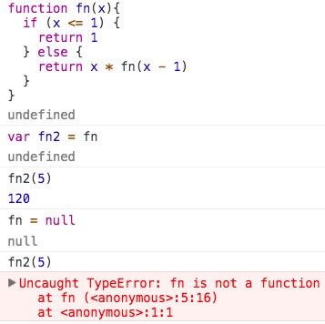

### 含义

**函数名为指针，JS没有函数重载**。

```
function sum(m, n){
  return m + n
}

var sum2 = sum // 指向同一个堆
sum = null // sum 指针关系断掉

console.log(sum2(1,1)) => 2 // sum2 指针关系任然存在

```

### 函数表达式与函数声明

* 区别：解释器会率先读取函数声明，使其在执行任何代码之前可以被调用。

---

### 函数的内部属性

在函数内部，有2个特殊的对象：`this` 与 `arguments`。

* `arguments`。是一个数组对象，包含传入函数得到所有参数。该对象有一个`callee`属性，是一个指针，指向拥有这个arguments对象的函数。

> 严格模式下，访问 `arguments.callee` 会报错



*使用`callee`对函数体内的代码与函数名进行解耦*


* `this`。函数执行的环境对象。
* `caller`。保存调用当前函数的函数引用，如果是在全局作用域中调用当前函数，它的值为null。

```
function fn1(){
  console.log(inner.caller)
}

function fn2(){
  fn1()
}

console.log(fn1()) => undefined

```
---

### 函数属性和方法

* `length`。接受参数的个数。
* `prototype`。对**引用类型**而言，`prototype`是*保存所有实力方法*的真正所在。**不可枚举**，因此不能用`for-in`。

#### `apply`,`call`

在特定的作用域中调用函数，实际上等同于设置函数体内的`this`对象的值。

* `apply`。接受2个参数，第1个参数是运行函数的作用域，第2个参数可以是`Array`或者 `arguments`。
* `call`。第1个参数是运行函数的作用域，后续的参数都直接传递给函数。

#### `bind`


