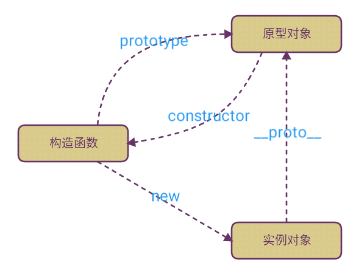

<a id="原型、原型链、对象、构造函数"></a>

## 原型、原型链、对象、构造函数



* 对象：无序的属性集合
* 构造函数：创建特定类型的对象
* 原型：只有函数有且每个函数都有prototype（原型）属性，指向函数的原型对象，原型对象包含函数实例共享的方法和属性
* 原型链：除了`undefined`和`null`外，JavaScript其他值都有`__proto__`隐式原型

---

## 箭头函数与普通函数

* **箭头函数的`this`永远指向其上下文的`this`，任何方法都改变不了其指向，如`call()`、`apply()`、`bind()`**
  * 箭头函数是匿名函数，不能作为构造函数，不能使用new
  * 不能绑定`arugments`
  * 不能绑定`this`，`this`为所在上下文的`this`，即使使用`apply`或`call`也不能改变
  * 没有原型属性
  * 不能当作`Generator`函数，不能使用`yield`
* 普通函数的`this`指向调用它的哪个对象

```js
let Fn = () => {
  console.log(arguments) // => RefrenceError: arguments is not defined
}
let f = new Fn() // => TypeError: not a constructor
console.log(Fn.prototype) // => undefined

let obj = {
  a: 1,
  fn: () => {
    console.log(this.a) // => udnefined
    console.log(this) // => Window
  },
  f: function () {
    console.log(this.a) // => 1
    console.log(this) // => {a: 1, fn: ƒ, f: ƒ}
  },
}
```

---

<a id="var、let、const">

## var、let、const

* **let**
  * 申明块级作用域
  * 变量不会被提升
  * 块级作用域内定义形成“暂存死区”
* **var**
  * 作用域限制在其声明位置的上下文中，而非声明变量总是全局的
  * 变量声明会被提前
* **const**
  * 声明创建一个值的只读引用 (即指针)
  * 将`const`申明的基本数据类型值改变时，将会造成报错
  * `const`申明的引用类型可改变其中某项的值

> 为什么可以重复`var`，解释器碰到`var`会向上寻找是否存在此变量，如果无则定义，如果有则忽略

---

<a id="类型转化"></a>

## 类型转化

* 函数转换：`parseInt()`、`parseFloat()`、`toString()`
* 强类型转换：`Boolean()`、`Number()`、`String()`
* 弱类型转换：`==`、`-`、`+`、`if()`

### `===`

* 2个值类型不同，则不相等
* 都是`null`或者都是`undefined`，则相等
* 都是`true`或者`false`，则相等
* 有个一为`NaN`，则不相等
* `-0 === 0`（类型相同，值相同）
* 如果都为字符串，则判断长度和内容
* 如果都是对象，则判断是否引用的是同一个对象

> `NaN`与任何值（包括`NaN`）都不相等，所以`x!==x`可判断`x`是否为`NaN`

### `==`

* null、undefined不会进行类型转换，但相等
* 如果有布尔值，`true`转化为1，`false`转化为0
* NaN 不与任何值相等
* 字符串与数字比较，把字符串转化为数字
* 如果对象与字符串或数字比较，对象先`valueOf()`再`toString()`取到原始值后进行比较
* 如果都是对象，则判断是否引用的是同一个对象

```
[] == 0 // true
'' == 0 // true
[] == false // true
{} == {} // false
{} == false // 异常 SyntaxError
Infinity == Infinity // true
```