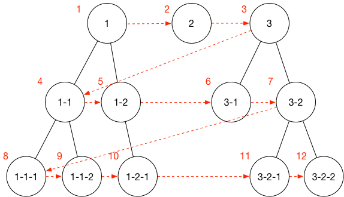

<a id="时间复杂度"></a>

## 常见的时间复杂度

执行函数 | 阶 | 术语
-----|-----|-----
12 | O(1) | 常数阶
2n+3 | O(*n*) | 线性阶
3n<sup>2</sup> + 2n + 1 | O(*n*<sup>2</sup>) | 平方阶
 | O(log*n*) | 对数阶 (logN底数默认为2)
 | O(*n*log*n*) | nlogn阶
 | O(*n*<sup>3</sup>) | 立方阶
 | O(2<sup>*n*</sup>) | 指数阶

**常用的时间复杂度耗时排序：**
常数阶 < 对数阶 < 线性阶 < nlogn阶 < 平方阶 < 立方阶 < 指数阶

<a id="冒泡排序"></a>

## 冒泡排序

> 每次比较相邻2个元素，如果顺序错误就交换位置。O(n<sup>2</sup>)，不稳定

```js
function bubbleSort(arr) {
  if (arr.length <= 1) {
    return arr
  }

  var len = arr.length

  for (var i = 0; i <= len - 1; i++) {
    for (var j = 0; j <= len -1; j++) {
      if (arr[j] > arr[j + 1]) {
        // var temp
        // temp = arr[j]
        // arr[j] = arr[j + 1]
        // arr[j + 1] = temp
        // 不通过临时变量实现变量交换
        arr[j + 1] = [arr[j], arr[j] = arr[j + 1]][0]
      }
    }
  }
  return arr
}
```

<a id="选择排序"></a>

## 选择排序

> 首先找到未排序最小元素放到首位，再寻找剩余的最小往后排。O(n<sup>2</sup>)，稳定

```js
function selectionSort (arr) {
  if (arr.length <= 1) {
    return arr
  }

  for (var i = 0; i < arr.length - 1; i++) {
    var minIndex = i;
    for (var j = i + 1; j < arr.length; j++) {
      if (arr[minIndex] > arr[j]) {
        minIndex = j;
      }
    }
    arr[i] = [arr[minIndex], arr[minIndex] = arr[i]][0]
  }

  return arr
}
```

<a id="快速排序"></a>

## 快速排序

> 取中间参照元素，小的放左数组，大的放右数组，再使用该方法继续排序。O(nlog<sub>n</sub>)，不稳定

```js
function quickSort(arr) {
  if (arr.length <= 1) {
    return arr
  }
  
  // 计算参照位
  var cIndex = Math.floor(arr.length / 2)
  var c = arr.splice(cIndex, 1)

  // 注意 Number([1]) === 1
  var l = []
  var r = []

  for (var i = 0; i < arr.length; i++) {
    if (arr[i] < c) {
      l.push(arr[i])
    } else {
      r.push(arr[i])
    }
  }

  return quickSort(l).concat(c, quickSort(r))
}
```

<a id="插入排序"></a>

## 插入排序

> 在已排序的序列中从后向前扫描，找到相应位置并插入。 O(n<sup>2</sup>)，稳定

```js
function insertionSort (arr) {
  // 第一个数肯定是有序的，从第2个数开始遍历，依次插入
  for (var i = 1; i < arr.length; i++) {
    var temp = arr[i]
    var j = i - 1 // i - 1 个数肯定是有序的
    while (j >= 0 && arr[j] > temp) {
      arr[j + 1] = arr[j]
      j-- 
    }
    arr[j + 1] = temp
  }
  return arr
}
```

<a id="二分搜索法"></a>

## 二分搜索法

也称折半搜索，是一种在有序数组中查找特定元素的搜索算法。

1. 首先从数组中间开始查找对比，若相等则找到，直接返回中间元素的索引。
2. 若查找值小于中间值，则在小于中间值的那一部分执行步骤1的操作。
3. 若查找值大于中间值，则在大于中间值的那一部分执行步骤1的操作。
4. 否则，返回结果为查不到，返回-1。

```js
// 递归实现
function binarySeach(target, arr, start, end) {
  var start = start || 0
  var end = end || arr.length - 1
  var mid = parseInt(start + (end - start) / 2)

  // 排除查找对象在数组之外
  if (target > arr[end] || target < arr[start]) {
    return -1
  } else if (target === arr[mid]) {
    return true
  } else if (target > arr[mid]) {
    return binarySeach(target, arr, mid + 1, end)
  } else {
    return binarySeach(target, arr, start, mid - 1)
  }
}

// 不使用递归
function binarySeach(target, arr, start, end) {
  var start = start || 0
  var end = end || arr.length - 1
  
  // 排除查找对象在数组之外
  if (target > arr[end] || target < arr[start]) {
    return -1
  }

  while (start <= end) {
    var mid = parseInt(start + (end - start) / 2)

    if (target === arr[mid]) {
      return mid
    } else if (target > arr[mid]) {
      start = mid + 1
    } else {
      end = mid - 1
    }
  }
}
```

### 无序的二分搜索

```js
function binarySeach(target, arr) {
  while (arr.length > 0) {
    // 快速排序
    var left = []
    var right = []
    var pivot = arr[0]

    for (var i = 1; i < arr.length; i++) {
      var item = arr[i]
      item > pivot ? right.push(item) : left.push(item)
    }

    if (target === pivot) {
      return true
    } else if (target > pivot) {
      arr = right
    } else {
      arr = left
    }
  }
}
```

<a id="二叉树"></a>

## 二叉树

二叉树的常用遍历为 前序遍历、中序遍历、后序遍历

```js
function Node (data, left, right) {
  this.data = data
  this.left = left
  this.right = right
}

function Tree () {
  this.root = null
}
/*
      1
  2       3
4   5   6   7
*/

Tree.prototype = {
  // 创建二叉树
  create: function () {
    var left = new Node(2, new Node(4), new Node(5))
    var right = new Node(3, new Node(6), new Node(7))
    this.root = new Node(1, left, right)
  },

  // 前序遍历
  front: function (root) {
    if (root) {
      console.log(root.data)
      this.front(root.left)
      this.front(root.right)
    }
  },

  // 中序遍历
  middle: function (root) {
    if (root) {
      this.middle(root.left)
      console.log(root.data)
      this.middle(root.right)
    }
  },

  // 后序遍历
  backend: function (root) {
    if (root) {
      this.backend(root.left)
      this.backend(root.right)
      console.log(root.data)
    }
  }
}

var tree = new Tree()
tree.create()
tree.front(tree.root)
tree.middle(tree.root)
tree.backend(tree.root)
```

<a id="tree"></a>

> 数据源

```js
[{
	"name": "1",
	"children": [{
		"name": "1-1",
		"children": [{
			"name": "1-1-1"
		}, {
			"name": "1-1-2"
		}]
	}, {
		"name": "1-2",
		"children": [{
			"name": "1-2-1"
		}]
	}]
}, {
	"name": "2"
}, {
	"name": "3",
	"children": [{
		"name": "3-1"
	}, {
		"name": "3-2",
		"children": [{
			"name": "3-2-1"
		}, {
			"name": "3-2-2"
		}]
	}]
}]
```

<a id="广度优先遍历"></a>

## 广度优先遍历



[数据源](#tree)

```js
function doBFS(dataSource) {
  let stack = [...dataSource]
  let item
  while (stack.length) {
    item = stack.shift()
    
    console.log(item.name)

    if (item.children && item.children.length) {
      stack = stack.concat(item.children)
    }
  }
}

// 打印

1
2
3
1-1
1-2
3-1
3-2
1-1-1
1-1-2
1-2-1
3-2-1
3-2-2
```

<a id="深度优先遍历"></a>

## 深度优先遍历


[数据源](#tree)

```js
function doDFS(dataSource) {
  let stack = [...dataSource]
  let item
  while (stack.length) {
    item = stack.shift()

    console.log(item.name)

    if (item.children && item.children.length) {
      stack = item.children.concat(stack)
    }
  }
}

// 打印
1
1-1
1-1-1
1-1-2
1-2
1-2-1
2
3
3-1
3-2
3-2-1
3-2-2
```

<a id="递归遍历"></a>

## 递归遍历

[数据源](#tree)

```js
function loop(source) {
  const dataSource = JSON.parse(JSON.stringify(source))
  let stack = [...dataSource]
  for (let i = 0, len = dataSource.length; i < len; i++) {

    console.log(dataSource[i].name)

    const children = dataSource[i].children
    if (children && children.length > 0) {
      loop(children)
    }
  }
}

// 打印，同上深度优先遍历
1
1-1
1-1-1
1-1-2
1-2
1-2-1
2
3
3-1
3-2
3-2-1
3-2-2
```

---

<a id="动态规划"></a>

## 动态规划

把原问题分解成子问题进行求解。

```js
// 计算斐波那契数列（每一项都等于前两项之和）
function fib (n) {
  let last = 1
  let nextLast = 1
  let result = 1
  for (let i = 2; i < n; i++) {
    result = last + nextLast
    nextLast = last
    last = result
  }
  return result
}

// 硬币找零
function makeCoin (coins, aim) {
  let min = [], amount = 0

  for (let i = 0; i < coins.length; i++) {
    let coin = coins[i]

  }
}
```

---

<a id="最大子序列之和"></a>

## 最大子序列之和

```js
function getMaxSeq (arr = []) {
	let max = arr[0], sum = arr[0];
	for (let i = 1, len = arr.length; i < len; i++) {
		sum += arr[i]
		max = Math.max(sum, max)
		if ( sum < arr[i]) {
			sum = arr[i]
		}
	}
	return max
}
```

---

<a id="最长公共子串"></a>

## 最长公共子串

```js
function getMaxStr(str1, str2){
  if (str1.length > str2.length) {
    str1 = [str2, str2 = str1][0]
  }
  const maxLen = str1.length

  for (let j = maxLen; j > 0; j--) {
    for (let i = 0; i < maxLen - j; i++) {
      const str = str1.substr(i, j)
      if (str2.indexOf(str) !== -1) {
        return str
      }
    }
  }

  return ''
}
```

---

<a id="最长公共子序列"></a>

## 最长公共子序列

```js
function lcs (str1, str2) {
  const len1 = str1.length
  const len2 = str2.length
  let dp = []

  for (let i = 0; i <= len1; i++) {
    dp[i] = []
    for (let j = 0; j <= len2; j++) {
      if(i == 0 || j == 0) {
        dp[i][j] = 0
        continue
      }

      if (str1[i - 1] == str2[j - 1]) {
        dp[i][j] = dp[i-1][j-1] + 1
      } else {
        dp[i][j] = Math.max(dp[i - 1][j], dp[i][j -1])
      }
    }
  }

  // 最长公共子序列的长度
  const maxLen = dp[len1][len2] // 返回二维数组最后一个值

  const maxStr = getStr(dp, str1, str2, len1, len2)

  return { maxLen, maxStr }
}

// 最长公共子序列
function getStr (dp, str1, str2, i, j) {
  if (i == 0 || j == 0) {
    return ""
  }

  if (str1[i - 1] == str2[j - 1]) {
    return printLCS(dp, str1, str2, i - 1, j - 1) + str1[i - 1]
  } else if (dp[i][j - 1] > dp[i - 1][j]) {
    return printLCS(dp, str1, str2, i, j - 1)
  } else {
    return printLCS(dp, str1, str2, i - 1, j)
  }
}
```

---

<a id="背包问题"></a>

## 背包问题

物品个数n=5，物品重量weights=[2，2，6，5，4],物品价值values=[6，3，5，4，6],背包总容量W=10

```js

/**
 *背包问题算法及个人理解
 *
 * @param {*} weightLimit 背包重量限制
 * @param {*} weightArray 物品重量组成的数组
 * @param {*} valueArray 物品价值组成的数组。注意顺序要与重量数组对应
 * @param {*} account 物品种类（number类型）
*/
function pack (weightLimit, weightArray, valueArray, account) {
  let dp = [] // 矩阵
  for (let i = 0; i <= account; i++) {
    dp[i] = []
    for (let j = 0; j <= weightLimit; j++) {
      if(i == 0 || j == 0) {
        dp[i][j] = 0
        continue
      }

      if (weightArray[i - 1] > j) {
        dp[i][j] = dp[i - 1][j]
      } else {
        let a = valueArray[i - 1] + dp[i - 1][j - weightArray[i - 1]];
        dp[i][j] = Math.max(a, dp[i - 1][j]);
      }
    }
  }

  return dp[account][weightLimit]
}
```

## 双向链表

```js
function Link(data, pre, next) {
  this.data = data
  this.pre = pre // 指向前一个指针
  if (this.pre) {
    pre.next = this
  }
  this.next = next // 指向后一个指针
}
Link.prototype.insert = function (node) {
  if (this.next && this.next.pre) {
    this.next.pre = node // 原来的后续节点的前一个变为新的
  }
  node.next = this.next // 新节点的下一个为原来的下一个
  node.pre = this // 原来的上一个为当前此节点
  this.next = node // 当前的下一个为新节点
}
Link.prototype.remove = function () {
  this.next.pre = this.pre
  this.pre.next = this.next
}
Link.prototype.console = function() {
  if (this.next) {
    return this.data + this.next.console
  } else {
    return this.data
  }
}
// 反转
Link.prototype.reverse = function () {
  var tmp = null
  var self = this

  function _reverse () {
    if (!this.next) {
      this.pre = null
      this.next = tmp
      return this
    } else {
      this.pre = this.next
      this.next = tmp
      tmp = this
      return _reverse.call(this.pre)
    }
  }

  return _reverse.call(this)
}
```