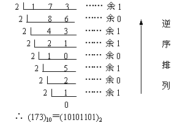
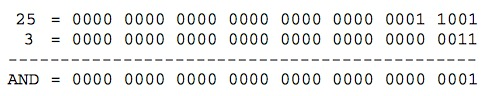
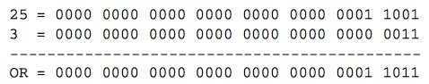
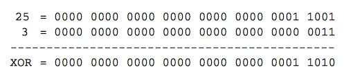

<a id="严格模式"></a>

## 严格模式

> [Javascript 严格模式详解](http://www.ruanyifeng.com/blog/2013/01/javascript_strict_mode) 

`"use strict";`用于消除缺陷语法

* 变量必须先声明
* 禁止使用`with`语句
* 创建eval作用域
* 禁止this指向全局
* 禁止在函数内部遍历调用栈
* 禁止删除变量

---

<a id="进制"></a>

## 进制

### 十进制转二进制

* 整数：**除2取余，逆序排列**。
* 小数：**乘2取整，顺序排列。**




### 二进制转十进制

**按权相加**


---

<a id="位操作"></a>

## 位操作

### 按位非`~`

**取负数减1**

```
~111 => -111 - 1 => -112
```

### 按位与`&`

位对齐、都为1返回1，否则返回0。如：`25 & 3 => 1`



### 按位或`|`

位对齐、都为0返回0，否则返回1。如：`25 | 3 => 27`



### 按位异或`^`

位对齐、只有一个1则返回1，否则返回0。如：`25 ^ 3 => 26`



---

<a id="精度"></a>

## 精度

> [该死的IEEE-754浮点数，说「约」就「约」，你的底线呢？以JS的名义来好好查查你](https://segmentfault.com/a/1190000009084877)

JS所有的**数值**都是以64-bit的双精度浮点数存储(IEEE-754 64)。


* 位操作符不能直接操作64位的值，而是先转换成32位后，再做运算。


> 待研究: `NaN`是怎么存储的?

---

## 栈内存与堆内存

* 栈：为编译器自动分配和释放
* 堆：为成员分配和释放，由程序员自己申请、释放

---

## 延长作用域链

1. `try-catch`语句的`catch`块
2. `with`