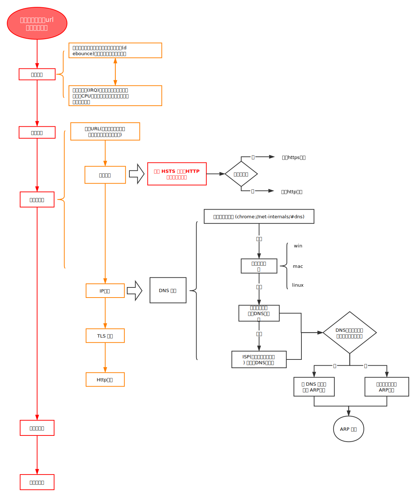

### 图解

### ARP过程

### TLS握手

### 参考

* [SSL/TLS 握手过程详解](https://www.jianshu.com/p/7158568e4867)
* [当你在浏览器中输入 google.com 并且按下回车之后发生了什么？](https://github.com/skyline75489/what-happens-when-zh_CN)
* [what-happens-when-you-enter-url-in-browser/](https://vincenthou.github.io/what-happens-when-you-enter-url-in-browser/)